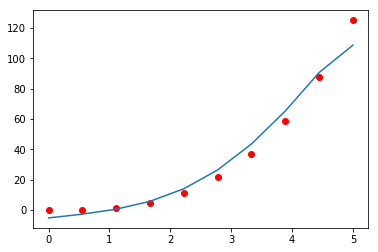

# B-splines
Weighted spline approximation (porting the built-in matlab function "spaps" to the Python language)

Example:

x = np.linspace(0, 5, 10)
y = x ** 3
w = np.ones(10)
sp1 = SmoothBSpline()
sp1.bspl(x, y, w, 1)
y1 = sp1.eval(x)

