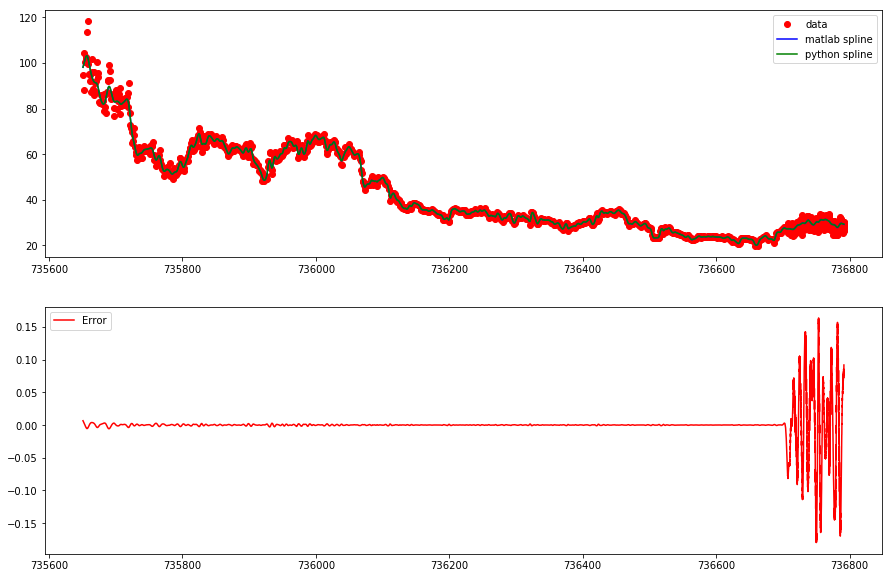

# B-splines
Weighted spline approximation (porting the built-in matlab function "spaps" to the Python language)

### Example:

x = np.linspace(0, 5, 10)

y = x ** 3

w = np.ones(10)

sp1 = SmoothBSpline()

sp1.bspl(x, y, w, 1)

y1 = sp1.eval(x)

### Testing on real data
Some experimental data, MatLab and Python splines are shown on the top panel. The difference between MatLab and Python splines is shown on the bottom panel.

